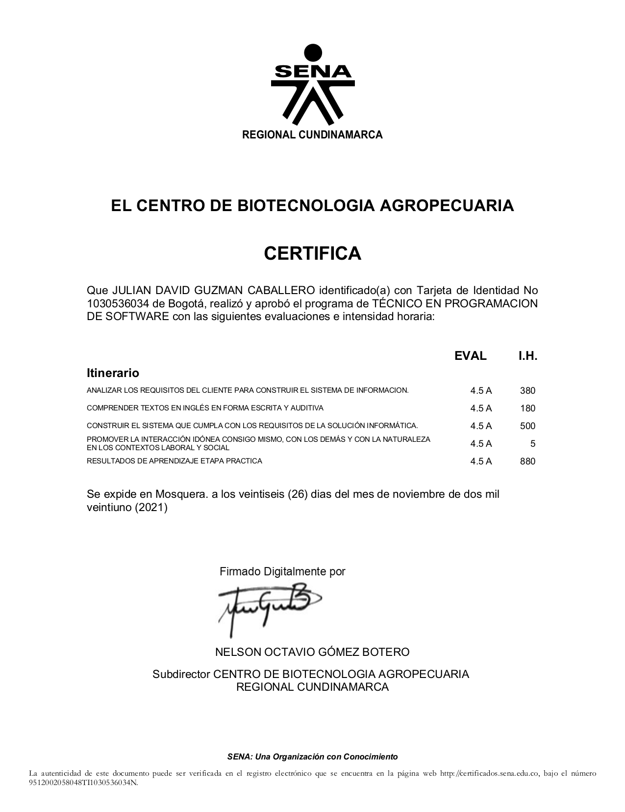
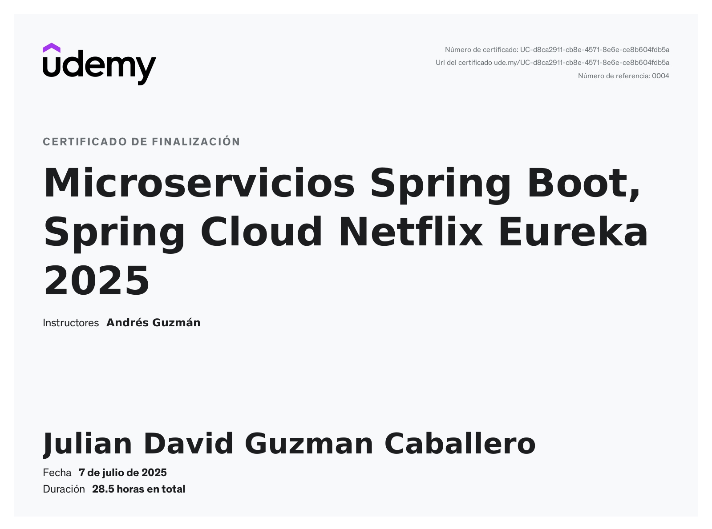

# Proyectos personales
- spring-boot-react-proyect-tienda

# Certificados laborales

# Certificados de estudio
- Tecnologo en Analisis y Desarrollo de Software:

- Tecnico en Programacion de Software:

- Udemy:

